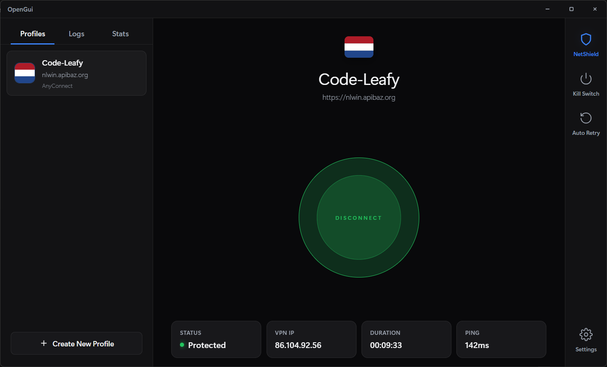
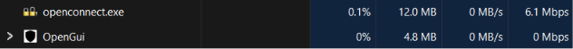

<div align="center">

# OpenGui

A fast, native Windows desktop client for the OpenConnect VPN — full protocol control with a modern, map-inspired interface.

[](https://rust-lang.org)
[](https://tauri.app)
[](https://github.com/Code-Leafy/OpenGui/blob/main/LICENSE)
[]()
[](https://github.com/Code-Leafy/OpenGui/releases/latest)

</div>

---

<div align="center">



</div>

<br>

## Overview

OpenGui is a lightweight, native desktop application for connecting to enterprise SSL VPNs through the [OpenConnect](https://www.infradead.org/openconnect/) engine. Built with Tauri 2 (Rust backend + a dependency-free static frontend), it wraps the full power of the `openconnect` command line in a clean point-and-click interface — no terminal, no Cisco AnyConnect, and none of the memory overhead of an Electron app.

The OpenConnect engine, `wintun.dll`, and the routing script are all bundled inside the installer, so there is nothing to install separately. Connect to AnyConnect, GlobalProtect, Pulse, Fortinet, F5, and more, with per-profile control over every meaningful protocol option.

> **Privacy First:** All credentials are stored in the Windows Credential Manager, never in plaintext on disk. Secrets are scrubbed from logs and zeroized from memory after use.

---

### Core Features

#### Multi-Protocol Support
Connect using any protocol the bundled OpenConnect engine speaks — **AnyConnect**, **Juniper Network Connect**, **GlobalProtect**, **Pulse Connect Secure**, **F5 BIG-IP**, **FortiGate**, and **Array Networks**.

#### Full Option Coverage
Every meaningful OpenConnect flag is exposed per profile through a curated Advanced panel — user agent, SNI, DTLS ciphers, MTU, DPD, CSD, certificate pinning, management-channel keys, and more. No hand-editing config files.

#### Country-Aware Profiles
Each profile shows the flag of the server's country, resolved automatically via GeoIP. A themed globe icon is used as a graceful fallback when a country cannot be determined.

#### Kill Switch
A firewall-backed kill switch blocks all traffic outside the tunnel, so a dropped connection never leaks your real IP. It self-heals on launch if a previous crash left rules behind.

#### NetShield DNS Protection
Optional DNS hardening applies secure resolvers on the tunnel adapter once the connection comes up, with malware/ad/tracker blocking toggles.

#### Secure Credential Storage
Passwords, TOTP secrets, token secrets, and key passwords are held in the Windows Credential Manager — never written to the profile file — and cleared from memory after use.

#### Multi-Factor Authentication
Built-in TOTP generation plus an interactive MFA prompt flow for servers that challenge for a one-time code at connect time.

#### Auto-Retry & Auto-Update
Automatically re-establish a dropped connection, and keep the app current with a signed, in-app auto-updater backed by GitHub Releases.

---

## Supported Protocols

| Protocol | Engine Flag | Typical Appliance |
|----------|-------------|-------------------|
| AnyConnect | `anyconnect` | Cisco ASA / Secure Client |
| Juniper Network Connect | `nc` | Juniper / Pulse legacy |
| GlobalProtect | `gp` | Palo Alto Networks |
| Pulse Connect Secure | `pulse` | Ivanti / Pulse Secure |
| F5 BIG-IP | `f5` | F5 BIG-IP APM |
| FortiGate | `fortinet` | Fortinet SSL VPN |
| Array Networks | `array` | Array AG |

---

## Lightweight by Design

OpenGui is built with Tauri 2 — a Rust backend paired with a dependency-free static frontend rendered by the OS's own WebView. There is no bundled Chromium, no Node runtime, and no heavyweight framework, so the app stays tiny both on disk (~10 MB installer) and in memory while running.

<div align="center">



</div>

<br>

As the Task Manager snapshot above shows, OpenGui sits idle at a **negligible CPU footprint** and only a **few megabytes of RAM** — a fraction of what an Electron-based client (which ships an entire browser per app) would consume. That means:

- **No background bloat** — it stays out of the way while your tunnel runs.
- **Instant startup** — the native WebView loads immediately, no cold-start JIT warm-up.
- **Runs anywhere** — comfortable even on low-spec laptops and virtual machines.

You get a full-featured VPN client that behaves like a small system utility, not a resource-hungry desktop app.

---

## Getting Started

### Install (Recommended)

1. Download the latest `OpenGui_x64-setup.exe` from the [**Releases**](https://github.com/Code-Leafy/OpenGui/releases/latest) page.
2. Run the installer. OpenGui requires administrator privileges to configure the tunnel adapter and firewall.
3. Add a profile, enter your server and username, tune any advanced options, and connect.

Once installed, OpenGui checks for signed updates automatically and can install them in place.

### Prerequisites (Development)

- [Rust](https://rustup.rs) (1.70+)
- [Tauri CLI](https://tauri.app) (`cargo install tauri-cli`)
- A prebuilt OpenConnect engine in `.toolchain/openconnect/` (committed to this repo)

### Development

```bash
# Clone the repository
git clone https://github.com/Code-Leafy/OpenGui.git
cd OpenGui

# Run in development (must be launched elevated on Windows)
cargo tauri dev
```

> The application embeds an administrator manifest, so `cargo tauri dev` must be started from an **elevated** terminal, otherwise Windows returns error 740.

### Build

```bash
# Build the production installer
cargo tauri build
```

The NSIS installer is written to `src-tauri/target/release/bundle/nsis/`.

---

## Project Structure

```text
OpenGui/
├── src/                          # Static frontend (no framework, no npm)
│   ├── index.html                # UI markup + styles
│   ├── app.js                    # State, IPC, rendering, event wiring
│   └── flags/                    # Country flag SVGs (4x3 + 1x1)
├── src-tauri/                    # Rust backend
│   ├── Cargo.toml                # Rust dependencies
│   ├── tauri.conf.json           # Tauri + bundle + updater config
│   ├── capabilities/             # Least-privilege permission grants
│   ├── icons/                    # App icons
│   └── src/
│       ├── main.rs               # Entry point, tray, command registration
│       ├── lib.rs                # Module exports
│       ├── commands.rs           # Tauri commands + arg building + validation
│       ├── process.rs            # openconnect child lifecycle
│       ├── parser.rs             # openconnect stdout/stderr parsing
│       ├── bridge.rs             # Frontend <-> backend event contract
│       ├── credentials.rs        # Windows Credential Manager
│       ├── killswitch.rs         # Firewall kill switch
│       ├── netshield.rs          # Tunnel DNS hardening
│       ├── geoip.rs              # Server country lookup
│       ├── settings.rs           # App settings persistence
│       ├── updater.rs            # Auto-update commands
│       ├── config.rs             # Profile storage
│       ├── logging.rs            # Leveled logging
│       └── types.rs              # Shared data models
├── .toolchain/openconnect/       # Bundled OpenConnect engine + DLLs
├── docs/BRIDGE.md                # Frontend/backend API contract
└── .github/workflows/release.yml # CI: build, sign, publish releases
```

---

## Auto-Update

OpenGui ships with the Tauri updater. Every published release includes a signed installer and a `latest.json` manifest generated in CI. On launch (and on demand), the app queries the latest release, verifies the update signature against an embedded public key, and installs it only if the signature is valid.

Releases are produced automatically: pushing a tag such as `v1.0.0` triggers the [release workflow](.github/workflows/release.yml), which builds the installer, signs it with the updater key stored as a repository secret, and publishes the artifacts plus `latest.json` to GitHub Releases.

---

<details>
<summary><kbd>FAQ</kbd></summary>

**Why does OpenGui require administrator privileges?**
Bringing up a VPN tunnel means creating a virtual network adapter and modifying the routing table, DNS, and firewall — all privileged operations on Windows. The app requests elevation up front so connecting is one click.

**Where are my passwords stored?**
In the Windows Credential Manager, under `openconnect-gui/<profile-id>` targets. They are never written to the profile file and are zeroized from memory after use.

**Which VPN appliances are supported?**
Any server that speaks one of the protocols in the table above. OpenGui bundles OpenConnect v9.x, which covers all major SSL-VPN vendors.

**Does the kill switch protect me if the app crashes?**
The kill switch is enforced by Windows Firewall rules, so it stays active even if the app dies. On next launch OpenGui clears any stale rules so you are never stranded offline.

**What is `wintun.dll` and do I need to install it?**
It is the user-space tunnel driver OpenConnect uses. It is bundled inside the installer — nothing extra to install.

</details>

<br>

<div align="center">

> **Educational Purpose Only:** This project is provided for educational and research purposes. Users are solely responsible for compliance with all local laws and their organization's acceptable-use policies.

[MIT License](https://github.com/Code-Leafy/OpenGui/blob/main/LICENSE) · Crafted by [Code-Leafy](https://github.com/Code-Leafy)

</div>
