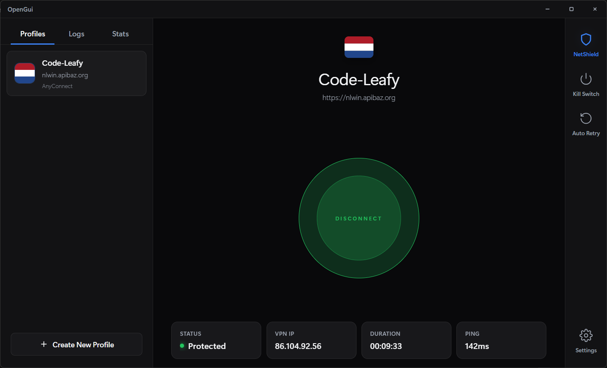

<div align="center">

# OpenGui

> Native Windows GUI for the OpenConnect VPN engine, built with Tauri 2.

[](LICENSE)
[](https://github.com/Code-Leafy/OpenGui/stargazers)
[](https://github.com/Code-Leafy/OpenGui/releases/latest)
[](https://rust-lang.org)
[](https://tauri.app)

</div>

## Overview

OpenGui wraps the `openconnect` command line in a point-and-click Windows app. The OpenConnect engine, `wintun.dll`, and routing script are bundled in the installer, so there is nothing extra to install.

## Preview

<div align="center">

</div>

## Features

- AnyConnect, Juniper, GlobalProtect, Pulse, F5, Fortinet, and Array protocols.
- Per-profile advanced options: SNI, DTLS, MTU, DPD, CSD, certificate pinning.
- Firewall-backed kill switch and DNS hardening (NetShield).
- TOTP and interactive MFA support.
- Credentials stored in Windows Credential Manager and zeroized after use.
- Signed auto-updates from GitHub Releases.

## Install

Download `OpenGui_x64-setup.exe` from the [latest release](https://github.com/Code-Leafy/OpenGui/releases/latest) and run it. Administrator rights are required to configure the tunnel adapter and firewall.

## Build from source

Prerequisites: [Rust 1.70+](https://rustup.rs) and the [Tauri CLI](https://tauri.app).

```bash
git clone https://github.com/Code-Leafy/OpenGui.git
cd OpenGui
cargo tauri dev      # run elevated on Windows
cargo tauri build    # installer → src-tauri/target/release/bundle/nsis/
```

## Supported protocols

| Protocol | Flag | Typical appliance |
|----------|------|-------------------|
| AnyConnect | `anyconnect` | Cisco ASA / Secure Client |
| Juniper Network Connect | `nc` | Juniper / Pulse legacy |
| GlobalProtect | `gp` | Palo Alto Networks |
| Pulse Connect Secure | `pulse` | Ivanti / Pulse Secure |
| F5 BIG-IP | `f5` | F5 BIG-IP APM |
| FortiGate | `fortinet` | Fortinet SSL VPN |
| Array Networks | `array` | Array AG |

## License

[MIT](LICENSE)

> Educational use. You are responsible for complying with local laws and your organization's acceptable-use policies.
